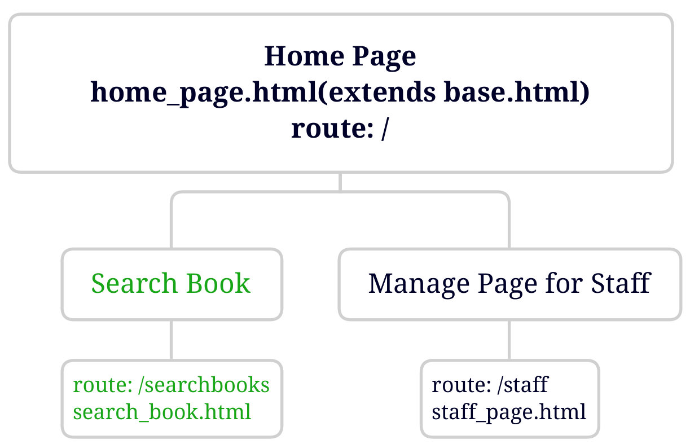
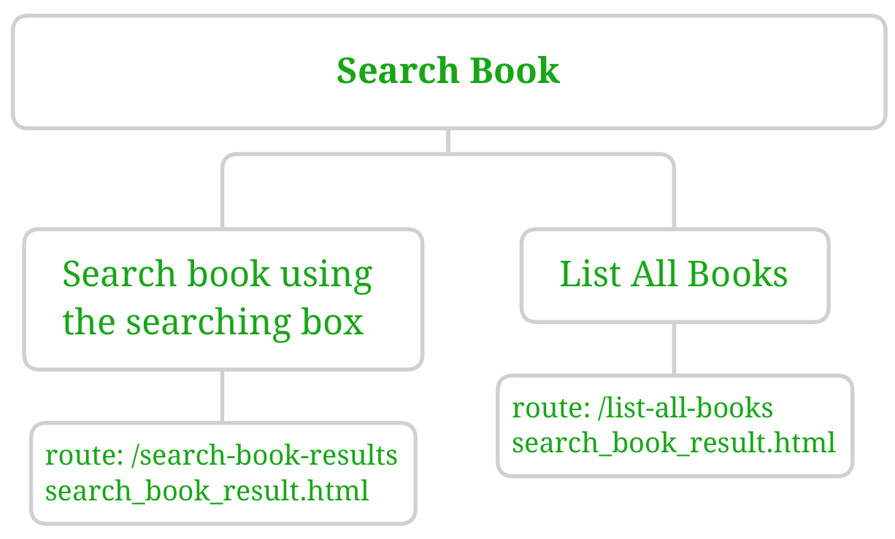
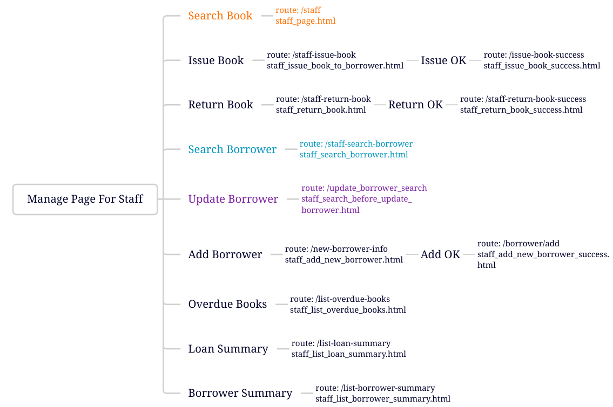
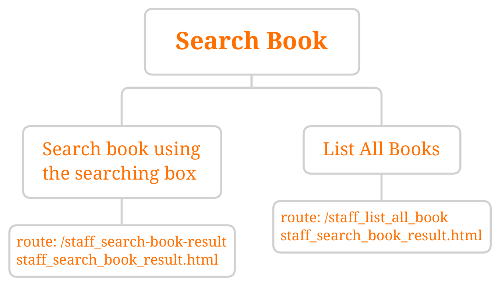
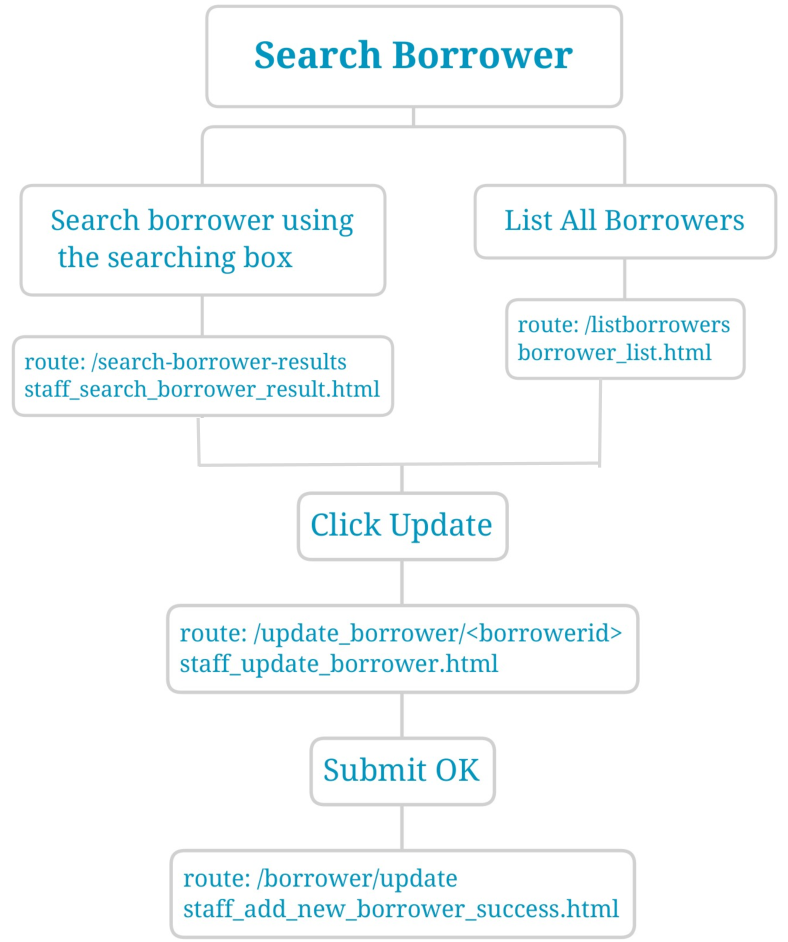
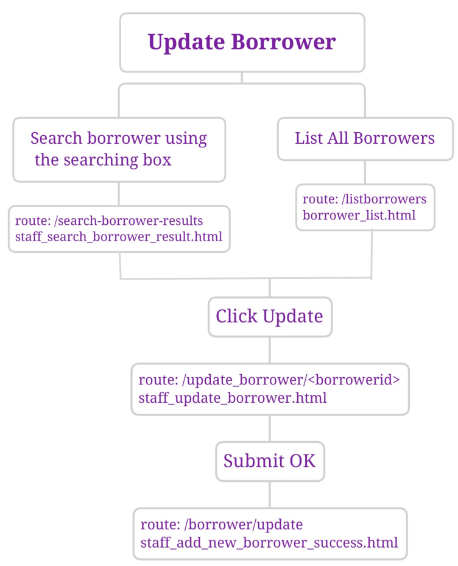

[//]: # (A flask web app to manage library data)
#  Web Application Report

## Outline of the Web Application
The application consists of two main parts. One is a public access for borrowers to search for books' availibility, the other one 
is for staff to manage borrowers and loans.

### Home Page
Home page extends base.html which has the top navigation bar, the home page can be accessed by default route(/). On the home page, there is a navigation bar on the header, the main body inludes library information on the left area, an big library pictureon the right area. Cantact and location will display on footer.

</img>

### Public Search Page
The public Search Book function is on the right of the navigation bar. Its route is /searchbooks, its template is search_book.html. The route will display a search box for people to enter book title or book author to search. After clicking search button, the template search_book_result.html will pass the book search result data to route /search-book-result. Search result data will display all the bookcopies including book title, book author, year of publication, status(availible or on loan), if it's on loan, display the due date.
On this page, List All Books can display the avalibility of all the bookcopies, pass the data from the template search_book_result.html to route /list-all-books.

</img> 

### Staff Page
Staff can access the Staff Page by the route /staff. There is a side bar on the right of the main body. The functions are all listed on the side bar, they are Search Book, Issue Book, Return Book, Search Borrower, Update Borrower, Add New Borrower, Overdue Books, Loan Summary, Borrower Summary. 

</img>

Search Book function displays on the staff main page, after staff finishing searching, the template staff_search_book_result.html will pass the book search result data to route /staff-search-book-result. Search result data will display the details of the bookkcopies including id, book title, book author, year of publication, status(availible or on loan), if it's on loan, display the due date. On this page, List All Books can display the avalibility of all the bookcopies, pass the data from the template staff_search_book_result.html to route /staff-list-all-books.

</img>

Issue Book and Return Book function both have a dropdown select form which also accept text input, so staff can search the information quickly. The template staff_issue_book_to_borrower.html and staff_return_book.html pass bookcopy and boorower data to route /staff-issue-book and staff-return-book.
After Issue book successfully, the loans table in the database will be inserted one loan data. After Returning book successfully, the loans table in the database will be updated on the Returned column. A List All Loans function provided for staff to check the updated data. A template current_loans.html will pass the latest loans to route /currentloans.

Search Borrower function is similar with the Search Book function, the template staff_search_borrower_result.html pass searched borrower details to route /search-boroower-result.
Apart form checking the borrower details, an Update function is provided on each borrower, staff can edit borrower from here directly. 

</img>

Update Borrower function needs staff to search borrower first, and then update the searched borrower, or staff can use List All Borrowers to list all the borrower and find the one to update.
After clicking Update, the staff_update_borrower will pass the exact borrower detail to route /update_borrower/<&ltborrowerid>, staff submit changes after editting any information, and then the borrowers table will updated by the change.

</img>

Add Borrower function displays a empty form for staff to input all the information of a new borrower, after finishing inputting the template staff_add_new_borrower passes the data to route /borrower/add,  and then the borrowers table inserts a new borrower.

Overdue Books function lists all the overdue books which have been on loan longer than 35 days. The template staff_list_overdue_books.html passes overdue bookcopies data to route /list-overdue-books.

Loan Summary function lists the loans data, including bookid, bookcopyid, book title, book format and the number of times each book has been loaned on total. The template staff_list_loan_summary.html passes loans data to route /list-loan-summary.
 
Borrower Summary function lists the borrower information including boorowerid, borrower full name, and the number of loans each borrower has had. The template staff_list_borrower_summary.html passes borrower data to route /list-borrower-summary.

## Design Decisions

The public Search Book funciton and Staff page share header navigation bar.

Searching result and list all books wil show the book details, but the book descriptions are too long, so the "title" attribute has been used to make it shorter, and user can see the whole detail information by hovering mouse on the description area.

This applicaiton used POST method on many page displays, such as search book, search borrower, using POST method to get the user input.
POST method is also used on the issue book, return book, add borrower and update borrower pages to get user input and update the database.

The Update Borrower and Add Borrower function make the length validation by using "maxlength" attribute to make sure that the database can be updated correctly.

The Issue Book and Return Book, both use "datalist" to increase search efficiency, user can not only choose bookcopy and borrower but also can enter text or numbers to search. 

The Search Book and Search Borrower page provide "List All" function to display all the bookcopies or borrowers.

The public Search Book result displays a descriptive list for book information, but the staff Search Book result displays a detailed table for staff to check more information.

## Discussion

Every branch's database must be needed if this application was to support multiple library branches. 

The books and bookcopies table need to add a column to indicate that which library branch this bookcopy is availible. Loans table needs to add a column to indicate which library branch this book has been returned to.( assuming that readers can return book to any branch) 

The current tables' need to change, in order to distinguish which branch table to use in the application. The borrower table can be shared for all the branches, so the result of Update Borrower and Add Borrower would share within branches too.

The web needs to add a branch access for public book search, because readers may want to see the availibility of books in the nearest branch. If user just uses the public search, the search result will list the branches each bookcopy is availible in.

Issue and Return Book would let the staff choose which branch they would like to issue from or return to. 

Staff page needs to add branch access for staff to check each branch's database information. For example, staff can search book from different branches, list all books of each branch, list loans summary and borrower summary in each branch. 